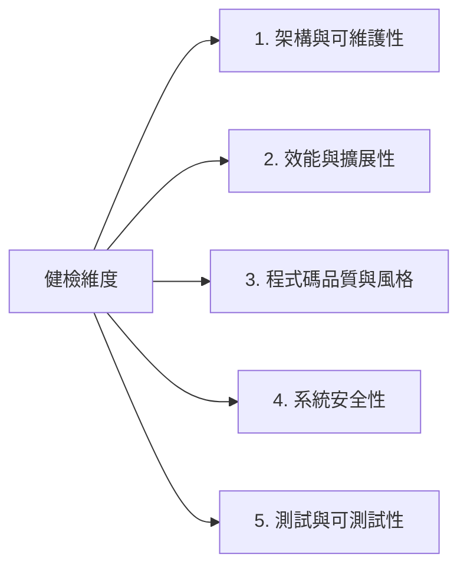
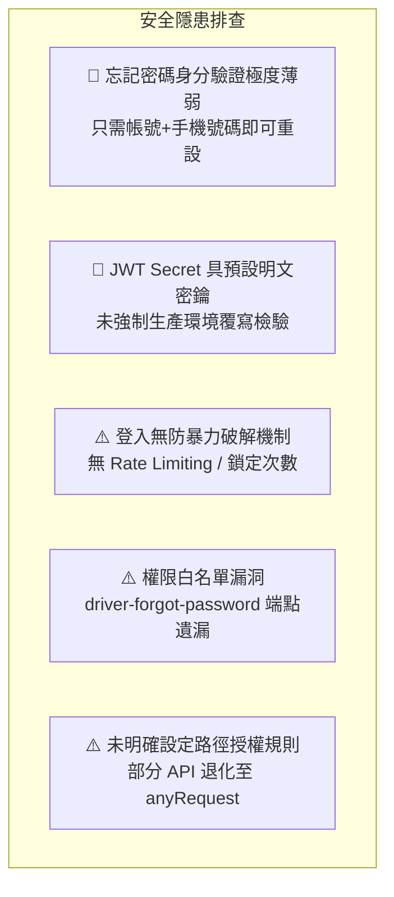
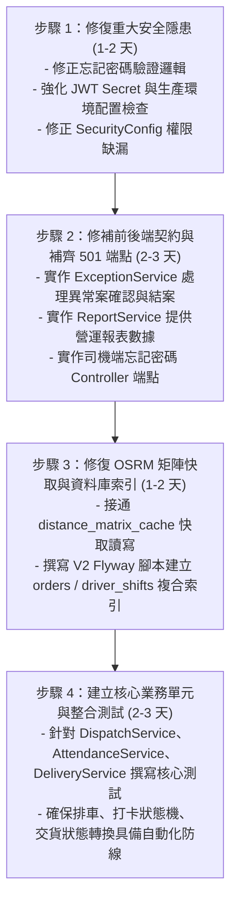

# 物流調度系統（logistics-dispatch）技術健檢與架構審查報告

> **評估角色**：資深軟體架構師 & 技術總監（Tech Lead）  
> **評估日期**：2026-09-21  
> **專案背景**：4人團隊開發半年之「司機物流配送系統」  
> **報告目標**：全面盤點架構、效能、品質、安全性、測試性與功能缺失，提供具體改善藍圖。

---

### 【綜合評分】

### 🌟 健康評分：**6.5 / 10**
> **一句話總結**：**「排車引擎與現代技術選型雛形優良，但因前後端契約斷層、安全認證機制薄弱、缺乏單元測試與快取索引優化，目前處於從『雛形原型』邁向『生產就緒（Production-Ready）』的關鍵陣痛期。」**

---

### 【技術堆疊總覽 (Tech Stack Inventory)】

| 領域 | 技術選型 | 說明與版本 |
| :--- | :--- | :--- |
| **後端核心** | Java 21 / Spring Boot 4.0.x / Gradle | 現代化 Java LTS 與 Gradle 構建系統 |
| **資料庫與 ORM** | MySQL 8.x / Spring Data JPA (Hibernate) / Flyway | Flyway 進行資料庫版控（V1 Baseline） |
| **排車演算法引擎** | Google OR-Tools 9.12 (Java Native) | CVRP（帶容量限制車輛路徑��題）最佳化 |
| **路網與地理運算** | 自架 OSRM (MLD 台灣路網) / OpenStreetMap | 距離矩陣運算與路線軌跡幾何計算 |
| **AI 智慧助理** | Spring AI 2.0 / DeepSeek-V4 API / Function Calling | 支援自然語言查詢、排班調整與排車指令 |
| **安全與驗證** | Spring Security 6 / Nimbus OAuth2 Resource Server / JWT | 雙角色權限（ADMIN / DRIVER）、AES 密鑰加密 |
| **管理後台前端** | Angular 19+ (Standalone Components) / TypeScript / Signals | 響應式狀態管理、Angular CDK Drag&Drop 看板、Chart.js |
| **司機端移動端** | Angular PWA / Service Worker / Web Geolocation | PWA 離線開啟、行動裝置 GPS 追蹤與打卡交貨 |
| **維運與部署** | Docker & Docker Compose / Nginx / GitHub Actions | Nginx 反向代理（SSL/同源轉發）、自動化 CI/CD |

---

### 【優勢亮點 (Highlights)】

1. **核心技術選型精準且具成本優勢**：
   - 採用 Google OR-Tools + 自架 OSRM 解決物流核心排車問題，完全免除昂貴的商業地圖 API（如 Google Distance Matrix API）費用，具備高自主性與擴展性。
2. **前後端技術版本先進**：
   - 後端採用 Java 21 與 Spring Boot 4 生態；前端全面採用 Angular Standalone Components 與 Signal 響應式狀態管理，擺脫舊版 NgModule 的臃腫架構。
3. **AI 整合架構具備前瞻性**：
   - Spring AI 整合 DeepSeek 支援 Tool Calling（Function Calling），並設計了「對話建議 $\rightarrow$ 待確認清單 $\rightarrow$ 人工確認執行」的雙重確認機制，避免 AI 直接破壞生產數據。
4. **司機端 PWA 體驗設計良好**：
   - 司機端考量行動場景，支援 PWA 加到主畫面、GPS 背景定期上傳機制、結合打卡狀態的 GPS 隱私防線（下班/休息不上傳）。
5. **資料庫具備版控機制**：
   - 引入 Flyway 管理資料庫 Schema，確保團隊協同開發與環境部署時資料結構的一致性。

---

### 【五大維度深入健檢分析】

#### 1. 架構與可維護性（Architecture & Maintainability）
- ⚠️ **前後端契約斷層（API Contract Mismatch）嚴重**：
  - 前端定義了完整的業務功能與介面，但後端存在多處 **501 NOT IMPLEMENTED** 或**端點完全缺失**：
    - `ExceptionController`（`/api/exceptions/**`）全部回傳 501，前端異常中心無法真正結案。
    - `ReportController`（`/api/reports/summary`）回傳 501，前端營運報表顯示「後端未提供」。
    - 司機端 `POST /api/driver/exception` 回傳 501。
    - 前端呼叫之 `/api/driver/profile`、`/api/driver/profile/photo`、`/api/driver/emergency-leave-requests`、`/api/driver-account-applications` 後端完全無對應 Controller 與 Entity。
- ⚠️ **包名命名筆誤（Package Typo）**：
  - 後端例外處理目錄誤拼為 `com.example.backend.excition`（應為 `exception`）。
  - DTO 回應套件誤拼為 `com.example.backend.dto.respones`（應為 `response`）。
- ⚠️ **單體內存狀態阻礙水平擴展（Horizontal Scalability Limitation）**：
  - `AiAssistantService` 中的 `pendingAction` 採用本地 `ConcurrentHashMap`，`ChatMemory` 亦為記憶體儲存。當系統重啟或部署多個 Pod/Instance 時，使用者的 AI 待辦事項與對話記憶將完全遺失或在不同節點間無法同步。
- ⚠️ **高耦合服務**：
  - `DispatchService` 單一類別承擔了 OSRM 溝通、OR-Tools 數據轉換、改派驗證、訂單綁定、發布撤回等超過 700 行代碼，缺乏子領域拆分（如拆出 `DispatchPlanService`、`RoutePublishService`）。

---

#### 2. 效能與擴展性（Performance & Scalability）
- 🚨 **快取機制形同虛設（Cache Bypass）**：
  - 資料庫設計了 `distance_matrix_cache` 距離矩陣快取表，但在 `DispatchService.optimize()` 中，系統**每次都直接向 OSRM 請求全部經緯度矩陣**，完全沒有讀取與寫入該快取表。當門市與倉庫數量增加時，會對 OSRM 造成不必要的重複計算負擔。
- 🚨 **OSRM 呼叫具 URL 長度爆掉風險（HTTP 414 URI Too Long）**：
  - `OsrmClient.table()` 將所有座標以字串拼接在 GET URL（`/table/v1/driving/{coords}?annotations=distance`）。當單次排車的門市與倉庫超過 100~200 個點時，URL 長度將突破 4KB~8KB 限制，導致 HTTP 414 請求失敗。
- ⚠️ **資料庫複合索引缺失（Missing Composite Indexes）**：
  - `orders` 表的查詢非常頻繁（如 `findByDeliveryDateAndStatusAndWarehouseIdAndRouteIdIsNull`），但 `V1__baseline.sql` 僅有外鍵與主鍵索引，缺少 `(delivery_date, warehouse_id, status)` 複合索引，日後單日訂單破千時將引發慢查詢。
- ⚠️ **缺乏分頁機制（No Pagination）**：
  - `OrdersService.findAll()`、`StoresService.findAll()`、`DriversService.findAll()` 均為全表載入，未引入 `Pageable`，未來資料量增長會導致記憶體暴增與頻寬浪費。
- ⚠️ **內存洩漏隱患（Memory Leak）**：
  - `AiAssistantService.pendingAction` 與 `ChatMemory` 未配置過期清除（TTL）或大小限制，長時間運行累積會消耗大量 Heap 記憶體。

---

#### 3. 程式碼品質與風格（Code Quality & Style）
- ⚠️ **例外處理反模式（Exception Anti-Pattern）**：
  - 後端大量直接拋出 `IllegalArgumentException` 與 `IllegalStateException`，缺乏自定義業務例外階層（如 `ResourceNotFoundException`, `BusinessValidationException`）。
  - `GlobalExceptionHandler` 將所有 `RuntimeException` 與 `IllegalArgumentException` 一律轉換為 `HTTP 400 Bad Request`。如果程式碼發生 `NullPointerException` 或資料庫死鎖，客戶端也會收到 400，掩蓋了真正的 500 錯誤與日誌追蹤。
- ⚠️ **大量重複程式碼（DRY Principle Violation）**：
  - `AdminUsersService` 與 `DriversService` 的忘記密碼驗證、密碼規則檢查完全重複拷貝。
  - DTO 與 Entity 的轉換大多手寫 `apply()` / `toDTO()`，欄位繁瑣且容易漏改。
- ⚠️ **API 回應格式不一致**：
  - 部分 API 回傳 `ApiResponse<T>`，部分回傳自定義 DTO，部分回傳 `Map<String, Object>`，前端攔截器需處理多種不同結構。

---

#### 4. 安全性（Security & Vulnerabilities）

- 🚨 **【高危險】忘記密碼認證極度薄弱（Account Takeover Risk）**：
  - 在 `AdminUsersService.resetForgottenPassword` 與 `DriversService.resetForgottenPassword` 中，重設密碼**僅比對 `account` 與 `phone` 是否吻合**，完全不需要發送 SMS 簡訊驗證碼、Email 驗證碼或出示舊密碼。
  - **後果**：攻擊者或離職員工只要知道同事的手機號碼，就能任意竄改管理員或司機的登入密碼，直接奪取帳號控制權！
- 🚨 **【高危險】預設 JWT Secret 與弱密鑰風險**：
  - `application.properties` 中預設密鑰為 `dev-only-change-this-jwt-secret-before-deploying-2026`。雖然有環境變數佔位符，但如果部署時未強制覆寫，外部攻擊者可利用該已知密鑰自行簽發 `role: "ADMIN"` 的合法 JWT Token，完全繞過後台登入驗證。
- ⚠️ **登入與密碼重設缺乏防暴力破解機制（No Rate Limiting）**：
  - `/api/auth/**` 端點無請求頻率限制（Rate Limiting）與錯誤次數鎖定機制，攻擊者可發動字典攻擊爆破帳號與手機號碼。
- ⚠️ **SecurityConfig 與 Controller 權限不一致**：
  - `SecurityConfig` 中設定了 `/api/auth/driver/forgot-password/verify` 與 `reset` 為 `permitAll()`，但在 `AuthController` 中根本沒有實作對應的 `@PostMapping`，導致司機端若要使用此功能會直接 404。
  - `/api/exceptions/**` 與 `/api/reports/**` 未在 `SecurityConfig` 顯式限定 `ROLE_ADMIN`，而是落入 `anyRequest().authenticated()`，存在司機角色越權存取的風險。

---

#### 5. 測試與可測試性（Testing & Testability）
- 🚨 **測試覆蓋率極低（< 5%）**：
  - 後端僅有 4 個測試類別（`BackendApplicationTests`, `AiApiKeyApiTest`, `OsrmClientTest`, `RouteOptimizerTest`）。
  - **重大盲點**：核心業務邏輯如 `DispatchService`（排車/改派/發布/撤回）、`AttendanceService`（打卡/休息超時狀態機）、`DeliveryService`（抵達/交貨/無人簽收/異常案生成）完全沒有任何單元測試或整合測試。
- ⚠️ **前端測試幾乎為空白**：
  - 前端僅有 Angular CLI 產生的初始 `.spec.ts`，未針對複雜的狀態轉換（如司機儀表板打卡流程、拖曳改派狀態聯動）編寫測試。

---

### 【重大風險 / ���燈 (Critical Issues)】
*必須優先於上線前解決的問題（按嚴重性排序）：*

1. 🔴 **安全性漏洞：忘記密碼身分驗證形同虛設**
   - **現狀**：只憑帳號 + 手機即可重設密碼。
   - **修正**：引入驗證碼機制（SMS OTP / Email Token）或由管理員後台人工重設密碼。
2. 🔴 **安全漏洞：生產環境 JWT 密鑰與敏感配置防護**
   - **現狀**：存在預設 JWT Secret，且啟動時未強校驗。
   - **修正**：在 `SecurityConfig` 或 Application 啟動檢查中，偵測若為生產環境且使用預設 Secret 時強制阻止 Application 啟動。
3. 🔴 **功能缺失：前後端功能斷層與 501 殘留**
   - **現狀**：`ExceptionController`、`ReportController`、司機端異常回報全部回傳 501；部分前端呼叫的 API（司機請假、帳號審核）後端完全不存在。
   - **修正**：補齊 `ExceptionService` 與 `ReportService` 邏輯，或將前端尚未實作的入口按鈕隱藏/降級，避免司機與調度員操作時遭遇非預期報錯。
4. 🔴 **效能隱患：OSRM 矩陣快取未接上與 GET URL 溢出風險**
   - **現狀**：未利用 `distance_matrix_cache` 快取表，且單一 GET 請求拼接過長座標串。
   - **修正**：排車前先查快取表，缺失點再批次調用 OSRM，或對長 URL 實施分批請求。

---

### 【改進建議 / 黃燈 (Medium Issues)】
*可優化但不致命的架構與品質改善項目：*

1. 🟡 **修復拼寫錯誤與套件結構**：
   - 將 `com.example.backend.excition` 更正為 `com.example.backend.exception`。
   - 將 `com.example.backend.dto.respones` 更正為 `com.example.backend.dto.response`。
2. 🟡 **建立完善的自定義例外體系**：
   - 建立 `BaseBusinessException`、`ResourceNotFoundException`、`ForbiddenOperationException`，並在 `GlobalExceptionHandler` 中對應至正確的 HTTP 狀態碼（404, 403, 409, 422），而非全部回傳 400。
3. 🟡 **資料庫建立高頻複合索引**：
   - 為 `orders(delivery_date, warehouse_id, status)`、`driver_shifts(driver_id, work_date)`、`routes(date, warehouse_id)` 新增 Flyway 遷移腳本（`V2__add_performance_indexes.sql`）。
4. 🟡 **AI 狀態持久化或快取清理機制**：
   - 為 `AiAssistantService.pendingAction` 加入定時過期清理機制（例如 2 小時未操作自動清除），或持久化至 Redis / 資料庫。
5. 🟡 **列表查詢分頁化（Pagination）**：
   - 為訂單管理、門市管理、車輛管理、司機管理列表 API 引入 Spring Data `Pageable`。

---

### 【具體行動清單 (Action Plan)】

建議團隊在接下來的 Sprint / 開發週期中，���先執行以下 **4 個具體改善步驟**：

1. **第一步（安全優先）**：
   - 關閉未經驗證的公開忘記密碼直接重設機制，改為管理員代為重設或加入驗證碼機制。
   - 檢查 `SecurityConfig`，確保生產環境禁止使用預設 JWT Secret，並補上 `/api/exceptions/**` 與 `/api/reports/**` 的 `hasRole('ADMIN')` 保護。
2. **第二步（功能補全）**：
   - 實作 `ExceptionService`，將無人簽收與司機回報的異常案件串接至後台確認流程（結案後將訂單狀態重設為待排車）。
   - 實作 `ReportService`，依據 `orders` 與 `routes` 計算當日/當週準點率、完成率與異常比例。
   - 在 `AuthController` 中補齊司機端忘記密碼的端點對應。
3. **第三步（效能與快取）**：
   - 啟用 `distance_matrix_cache`：在呼叫 OSRM 前先批次查詢已知門市與倉庫的距離與時間，僅對未快取的點位調用 OSRM，並寫回快取表。
   - 建立 Flyway `V2__add_performance_indexes.sql`，補齊 `orders` 與 `driver_shifts` 的複合查詢索引。
4. **第四步（測試防線建立）**：
   - 針對 `DispatchService`（特別是 `reassign` 與 `optimize` 的邊界檢查）、`AttendanceService`（打卡、休息 60 分鐘超時、下班防線）與 `DeliveryService` 撰寫至少 15~20 個高覆蓋率單元測試，防止後續迭代引發回歸 Bug。
